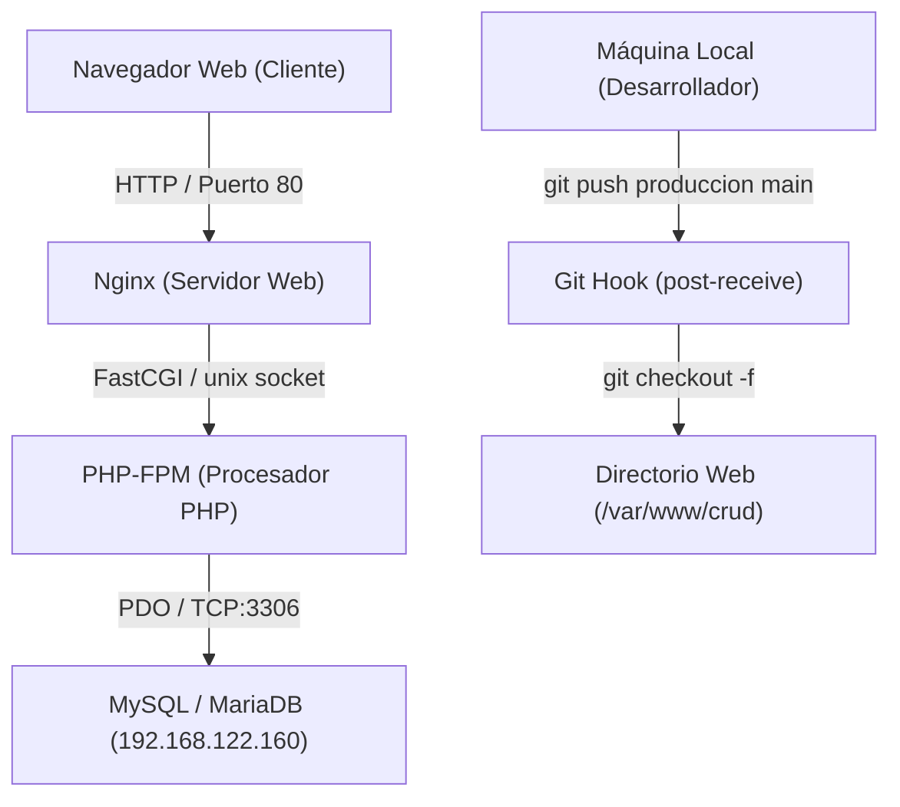

# Documentación del Proyecto: Sistema CRUD de Alumnos

**Materia:** Servidores 2  
**Práctica:** Práctica 1 - Unidad 2  
**Tecnologías:** PHP (PHP-FPM), Nginx, MySQL/MariaDB, Vanilla JavaScript, CSS3  
**Arquitectura:** Servidor Web + API REST + Base de Datos + Despliegue Automatizado con Git Hooks  

---

## 📋 Índice

1. [Descripción General](#-descripción-general)
2. [Arquitectura del Sistema](#-arquitectura-del-sistema)
3. [Registro Histórico de Prompts](#-registro-histórico-de-prompts)
4. [Pasos para Levantar y Configurar el Sistema](#-pasos-para-levantar-y-configurar-el-sistema)
   - [Paso 1: Configuración de la Base de Datos (MySQL)](#paso-1-configuración-de-la-base-de-datos-mysql)
   - [Paso 2: Configuración del Servidor Web (Nginx y PHP-FPM)](#paso-2-configuración-del-servidor-web-nginx-y-php-fpm)
   - [Paso 3: Automatización de Despliegue (Git Hook post-receive)](#paso-3-automatización-de-despliegue-git-hook-post-receive)
   - [Paso 4: Publicación y Despliegue desde la Máquina Local](#paso-4-publicación-y-despliegue-desde-la-máquina-local)
5. [Estructura del Proyecto](#-estructura-del-proyecto)
6. [Demostración de Seguridad: Política de Privilegios](#-demostración-de-seguridad-política-de-privilegios)
7. [Endpoints de la API](#-endpoints-de-la-api)

---

## 🎯 Descripción General

Este proyecto consiste en una aplicación web interactiva que gestiona alumnos universitarios (ID, Nombre, Carrera) mediante un flujo CRUD completo. Implementa una arquitectura desacoplada donde el frontend consume asíncronamente una API REST en PHP mediante `fetch`, apoyándose en modales de confirmación y notificaciones toast con microanimaciones y temporizadores.

Adicionalmente, el sistema fue diseñado con propósitos didácticos para demostrar el **Principio de Privilegio Mínimo** en bases de datos: el usuario web (`app_web`) cuenta únicamente con permisos de lectura (`SELECT`) y creación (`INSERT`), restringiendo deliberadamente la modificación (`UPDATE`) y el borrado (`DELETE`), reflejando dichos bloqueos en la interfaz gráfica.

---

## 🏗 Arquitectura del Sistema



---

## 💬 Registro Histórico de Prompts

A continuación se documenta la cronología de requerimientos y consultas realizadas durante el ciclo de vida del proyecto:

### Prompt 1: Planificación Inicial
> **Prompt:**  
> *"haz un plan:*  
> *necesito hacer una pagina con un crud de php (php-fpm php-mysql y nginx) para una base de datos mysql, usa modales y toast para verificaciones y validaciones."*

* **Objetivo:** Definir la hoja de ruta técnica y la arquitectura del proyecto.
* **Resultado:** Se inspeccionó el repositorio y la base de datos remota (`demo_servidores2`), diseñando un plan de 5 fases que abarcaba la conexión PDO, la API REST en JSON, la vista moderna con Vanilla CSS y JavaScript, los componentes de interfaz (modales y toasts) y la configuración de Nginx.

---

### Prompt 2: Inicio de la Implementación
> **Prompt:**  
> *"si, empecemos"*

* **Objetivo:** Construir los archivos fundacionales del proyecto.
* **Resultado:**
  * Creación de `config/db.php` con conector PDO optimizado y manejo de excepciones.
  * Creación de `api/alumnos.php` con métodos `GET`, `POST`, `PUT`, `DELETE` y validación en backend.
  * Creación de `assets/css/styles.css` con diseño oscuro moderno (*slate*), modales difuminados (*backdrop blur*) y sistema de toasts.
  * Creación de `assets/js/app.js` gestionando la interacción asíncrona, búsqueda en tiempo real, eventos de teclado y animaciones.
  * Creación de `index.php` y la plantilla de servidor `nginx-crud.conf.example`.

---

### Prompt 3: Automatización de Despliegues con Git
> **Prompt:**  
> *"como hago un hook post-receive para este app en mi servidor 192.168.122.160?"*

* **Objetivo:** Implementar Integración y Despliegue Continuo (CI/CD básico) vía Git.
* **Resultado:** Se documentaron los pasos para configurar un repositorio *bare* en `~/repos/crud.git`, programar el script `hooks/post-receive` que ejecuta `checkout -f` hacia `/var/www/crud` y dar de alta el remoto en el equipo de desarrollo.

---

### Prompt 4: Gestión de Múltiples Repositorios Git
> **Prompt:**  
> *"y si ya tengo un repo?"*

* **Objetivo:** Integrar el servidor de despliegue cuando el proyecto ya tiene un repositorio local vinculado a GitHub.
* **Resultado:** Se explicó el uso de múltiples remotos (`git remote add produccion ...`), permitiendo versionar en GitHub (`origin`) y desplegar en el servidor de pruebas (`produccion`) sin conflictos.

---

### Prompt 5: Consulta de Enrutamiento y Endpoints
> **Prompt:**  
> *"cual es el endpoint para ver la pagina web?"*

* **Objetivo:** Conocer las URLs exactas para acceder a la aplicación web y a los servicios backend.
* **Resultado:** Se especificó el acceso a la interfaz gráfica (`http://192.168.122.160/`) y las rutas de la API (`http://192.168.122.160/api/alumnos.php`).

---

### Prompt 6: Resolución de Discrepancia de Ramas en Git
> **Prompt:**  
> *"los archivos de la pagina web no se pasan al servidor"*

* **Objetivo:** Diagnosticar por qué el hook no transfería los cambios recién creados.
* **Resultado:** Se detectó que el trabajo se realizó en la rama local `develop`, mientras que la rama `main` permanecía en el commit inicial y el hook desplegaba `main`. Se unificaron las ramas mediante `git merge develop` y se empujó a `produccion main`.

---

### Prompt 7: Configuración de Nginx
> **Prompt:**  
> *"como configuro nginx para poner esta config? server { ... }"*

* **Objetivo:** Activar el bloque de servidor en Nginx apuntando al directorio `/var/www/crud` y asociándolo con PHP-FPM.
* **Resultado:** Se detallaron los pasos para crear `/etc/nginx/sites-available/crud`, vincularlo a `sites-enabled`, detectar el socket activo de PHP-FPM (`/run/php/php*-fpm.sock`), desactivar el sitio default y reiniciar el servicio.

---

### Prompt 8: Depuración de Assets y Conexión de Base de Datos
> **Prompt:**  
> *"ya puedo ver la app, pero no tiene css y no carga datos de la bd"*

* **Objetivo:** Corregir la falta de estilos visuales y la falla en la consulta de datos.
* **Resultado:**
  * **CSS:** Se solucionó el caché del navegador incorporando parámetros de versión en los enlaces (`styles.css?v=2.0`).
  * **Base de datos:** Se corrigió un desajuste en el conector donde `query()` retornaba un arreglo en lugar del objeto de consulta, restaurando PDO nativo directo.

---

### Prompt 9: Manejo de Compatibilidad en Entornos PHP Mínimos
> **Prompt:**  
> *"Tengo este error al introducir nuevos alumnos, Error al Guardar JSON.parse: unexpected end of data at line 1 column 1 of the JSON data Status 500"*

* **Objetivo:** Solucionar el fallo al registrar alumnos por POST.
* **Resultado:** Se detectó que el servidor no contaba con la biblioteca opcional `php-mbstring`, haciendo que `mb_strlen()` produjera un error fatal. Se implementó una función auxiliar de medición de longitud de cadenas (`strLength`) totalmente independiente de módulos externos.

---

### Prompt 10: Demostración Didáctica de Seguridad (Permiso Denegado)
> **Prompt:**  
> *"haz un mensaje para el toast para cuando el usuario no tiene permitido hacer update y delete en la base de datos, la idea del edit y el borrar es demostrar que no se tiene permisos de update y delete"*

* **Objetivo:** Configurar una experiencia interactiva para evidenciar la falta de permisos de `UPDATE` y `DELETE`.
* **Resultado:**
  * En `api/alumnos.php`: Detección del código de error MySQL `1142` (*command denied*) y respuesta controlada con código HTTP `403 Forbidden`.
  * En `assets/js/app.js`: Despliegue de un Toast de advertencia con el título **"Permiso Denegado"**, mensaje explicativo de seguridad y cierre automático del modal tras 6.5 segundos.

---

## 🚀 Pasos para Levantar y Configurar el Sistema

### Paso 1: Configuración de la Base de Datos (MySQL)

En el servidor de base de datos (`192.168.122.160`):

1. **Crear la base de datos y la tabla:**
   ```sql
   CREATE DATABASE IF NOT EXISTS demo_servidores2 CHARACTER SET utf8mb4 COLLATE utf8mb4_unicode_ci;
   USE demo_servidores2;

   CREATE TABLE IF NOT EXISTS alumnos (
       id INT AUTO_INCREMENT PRIMARY KEY,
       nombre VARCHAR(100) NOT NULL,
       carrera VARCHAR(100) NOT NULL
   );

   -- Datos iniciales
   INSERT INTO alumnos (nombre, carrera) VALUES
   ('Ana Torres', 'Sistemas'),
   ('Luis Pérez', 'Sistemas'),
   ('Marco Ruiz', 'Sistemas');
   ```

2. **Crear el usuario con permisos restringidos (Propósito didáctico):**
   ```sql
   CREATE USER IF NOT EXISTS 'app_web'@'localhost' IDENTIFIED BY 'ClaveApp123';
   CREATE USER IF NOT EXISTS 'app_web'@'%' IDENTIFIED BY 'ClaveApp123';

   -- Conceder ÚNICAMENTE SELECT e INSERT (sin UPDATE ni DELETE)
   GRANT SELECT, INSERT ON demo_servidores2.* TO 'app_web'@'localhost';
   GRANT SELECT, INSERT ON demo_servidores2.* TO 'app_web'@'%';
   FLUSH PRIVILEGES;
   ```

---

### Paso 2: Configuración del Servidor Web (Nginx y PHP-FPM)

En el servidor web:

1. **Instalar los paquetes necesarios:**
   ```bash
   sudo apt update
   sudo apt install -y nginx php-fpm php-mysql git
   ```

2. **Crear el directorio raíz del proyecto:**
   ```bash
   sudo mkdir -p /var/www/crud
   sudo chown -R $USER:www-data /var/www/crud
   sudo chmod -R 775 /var/www/crud
   ```

3. **Verificar el socket de PHP-FPM activo:**
   ```bash
   ls /run/php/
   # Ejemplo de salida: php8.2-fpm.sock o php8.3-fpm.sock
   ```

4. **Crear el archivo de VirtualHost en Nginx:**
   ```bash
   sudo nano /etc/nginx/sites-available/crud
   ```
   *Contenido:*
   ```nginx
   server {
       listen 80;
       server_name 192.168.122.160;

       root /var/www/crud;
       index index.php index.html;

       location / {
           try_files $uri $uri/ /index.php?$query_string;
       }

       location ~ \.php$ {
           include fastcgi_params;
           fastcgi_pass unix:/run/php/php8.2-fpm.sock; # Ajustar según versión instalada
           fastcgi_index index.php;
           fastcgi_param SCRIPT_FILENAME $realpath_root$fastcgi_script_name;
       }

       location ~ /\. {
           deny all;
       }
   }
   ```

5. **Habilitar el sitio y reiniciar Nginx:**
   ```bash
   sudo ln -sf /etc/nginx/sites-available/crud /etc/nginx/sites-enabled/
   sudo rm -f /etc/nginx/sites-enabled/default
   sudo nginx -t
   sudo systemctl restart nginx
   ```

---

### Paso 3: Automatización de Despliegue (Git Hook post-receive)

En el servidor web:

1. **Crear el repositorio Git bare:**
   ```bash
   mkdir -p ~/repos/crud.git
   cd ~/repos/crud.git
   git init --bare
   ```

2. **Crear el script del hook `post-receive`:**
   ```bash
   nano ~/repos/crud.git/hooks/post-receive
   ```
   *Contenido:*
   ```bash
   #!/bin/bash
   TARGET="/var/www/crud"
   GIT_DIR="/home/$USER/repos/crud.git"
   BRANCH="main"

   echo "----------------------------------------"
   echo "🚀 Recibiendo cambios en el servidor..."
   echo "Desplegando en: $TARGET"
   echo "----------------------------------------"

   git --work-tree=$TARGET --git-dir=$GIT_DIR checkout -f $BRANCH

   # Ajustar permisos para el servidor web
   chown -R www-data:www-data $TARGET 2>/dev/null || true
   chmod -R 755 $TARGET

   echo "✅ Despliegue completado con éxito."
   ```

3. **Otorgar permisos de ejecución al hook:**
   ```bash
   chmod +x ~/repos/crud.git/hooks/post-receive
   ```

---

### Paso 4: Publicación y Despliegue desde la Máquina Local

En tu computadora de desarrollo (dentro de la carpeta del proyecto):

1. **Añadir el servidor como control remoto:**
   ```bash
   git remote add produccion ltona@192.168.122.160:~/repos/crud.git
   ```

2. **Confirmar los cambios y desplegar a producción:**
   ```bash
   git checkout main
   git merge develop
   git push produccion main
   ```

3. **Verificación en el navegador:**
   Acceder a: `http://192.168.122.160/`

---

## 📁 Estructura del Proyecto

```text
pagina/
├── api/
│   └── alumnos.php            # Endpoint REST: gestiona peticiones GET, POST, PUT y DELETE
├── assets/
│   ├── css/
│   │   └── styles.css         # Hoja de estilos (diseño responsivo, modales y toasts)
│   └── js/
│       └── app.js            # Lógica dinámica: peticiones fetch, validación y feedback visual
├── config/
│   └── db.php                 # Conexión universal (PDO con fallback y seguridad UTF-8)
├── DOCUMENTACION.md           # Documentación integral de prompts, arquitectura y despliegue
├── index.php                  # Página principal (Single Page Application ligera)
├── nginx-crud.conf.example    # Ejemplo de configuración para el servidor Nginx
└── README.md                  # Información básica del repositorio
```

---

## 🔒 Demostración de Seguridad: Política de Privilegios

El sistema incluye una demostración de control de acceso a nivel de motor de base de datos:

| Operación | Método HTTP | Permiso en MySQL | Respuesta del Sistema |
| :--- | :---: | :---: | :--- |
| **Consultar Alumnos** | `GET` | `SELECT` (Permitido) | La tabla carga los registros exitosamente. |
| **Crear Alumno** | `POST` | `INSERT` (Permitido) | Se guarda el alumno y se muestra Toast de éxito (Verde). |
| **Editar Alumno** | `PUT` | `UPDATE` (Denegado) | El servidor responde **HTTP 403 Forbidden**. Se muestra Toast de advertencia: *"Permiso Denegado"*. |
| **Eliminar Alumno** | `DELETE` | `DELETE` (Denegado) | El servidor responde **HTTP 403 Forbidden**. Se muestra Toast de advertencia: *"Permiso Denegado"*. |

---

## 📡 Endpoints de la API

| Método | URL | Descripción | Parámetros / Cuerpo |
| :--- | :--- | :--- | :--- |
| **GET** | `/api/alumnos.php` | Lista todos los alumnos registrados | Ninguno |
| **GET** | `/api/alumnos.php?id={id}` | Obtiene el detalle de un alumno | `id` (Query String) |
| **POST** | `/api/alumnos.php` | Crea un nuevo registro | `{"nombre": "...", "carrera": "..."}` |
| **PUT** | `/api/alumnos.php` | Modifica un registro existente | `{"id": 1, "nombre": "...", "carrera": "..."}` |
| **DELETE** | `/api/alumnos.php?id={id}` | Elimina un alumno | `id` (Query String o Body JSON) |
